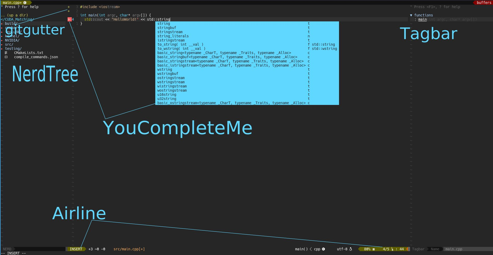

# My-Vim-Config



### I use :
- [vim-plug](https://github.com/junegunn/vim-plug)
- [A](https://github.com/vim-scripts/a.vim)
- [Airline](https://github.com/vim-airline/vim-airline)
- [NerdTree](https://github.com/scrooloose/nerdtree)
- [tender](https://github.com/jacoborus/tender.vim)
- [Tagbar](https://github.com/majutsushi/tagbar)
- [YouCompeleteMe](https://github.com/Valloric/YouCompleteMe)
- [chromatica](https://github.com/arakashic/chromatica.nvim)
- [DoxygenToolKit](https://github.com/mrtazz/DoxygenToolkit.vim)
- [vim-clang-format](https://github.com/rhysd/vim-clang-format)
- [indentLine](https://github.com/Yggdroot/indentLine)
- [vim-bookmarks](https://github.com/MattesGroeger/vim-bookmarks)
- [vim-minimap](https://github.com/severin-lemaignan/vim-minimap)
- [vim-easy-align](https://github.com/junegunn/vim-easy-align)
- [FastFold](https://github.com/Konfekt/FastFold)
- [sourcetrail](https://github.com/CoatiSoftware/vim-sourcetrail)
- [devicons](https://github.com/ryanoasis/vim-devicons)
- [gitgutter](https://github.com/airblade/vim-gitgutter)
- [lldb](https://github.com/critiqjo/lldb.nvim)
- [fzf](https://github.com/junegunn/fzf)
- [glsl](https://github.com/tikhomirov/vim-glsl)
- [keysound](https://github.com/skywind3000/vim-keysound)
- [qml](https://github.com/peterhoeg/vim-qml)
- [ultisnips](https://github.com/SirVer/ultisnips)
- [vimade](https://github.com/TaDaa/vimade)
- [cmake](https://github.com/vhdirk/vim-cmake)
- [fugitive](https://github.com/tpope/vim-fugitive)
- [neomake](https://github.com/neomake/neomake)

### Installation:
- For Ubuntu
    ```sh
    $ sh install_ubuntu.sh
    $ sh install_neovim.sh
    ```
- For Fedora
    ```sh
    $ sh install_fedora.sh
    ```
